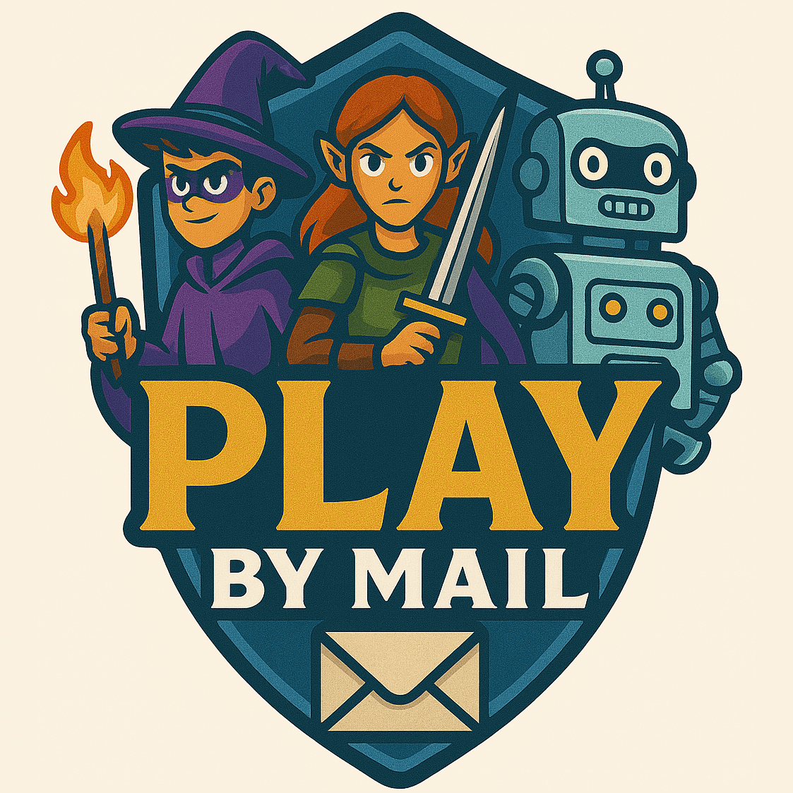

# Play by Mail

<!-- markdownlint-disable MD033-->

A play-by-mail platform for all types of turn-based games, supporting both email and physical mail, for all ages.

<a href="https://playbymail.games">playbymail.games</a>

Game content, communication, and visuals are delivered by email or physical mail. Turn processing and game state updates are automated; players submit turns by email or by returning forms and puzzles through the mail, with human review only when needed.

The platform supports the full spectrum of turn-based game types: RPG, strategy, wargames, adventure, sports, diplomacy, 4X, economic simulations, and more. Designers get flexible tools to create and publish games, storylines, maps, and puzzles, optimized for both digital and print delivery. Players get diverse turn-based experiences—from narrative adventures to complex strategic campaigns—whether they prefer email or physical mail.

Privacy, security, age-appropriateness, and inclusivity are core principles, with support for parental controls and accessibility.

AI is integrated where appropriate, always subject to human review for narrative and safety.

## License

Yet to be determined.

**Important**: PlayByMail is a **turn-based game platform**—games are played via email or physical mail, not in real time. Email is the primary play method: players receive turn sheets by email and submit moves online. Physical mail is also fully supported. The web interface is for game designers, managers, and administrators to create and manage these games.
